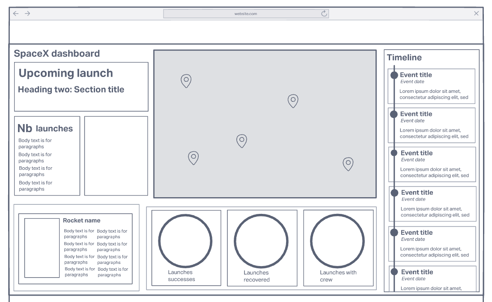
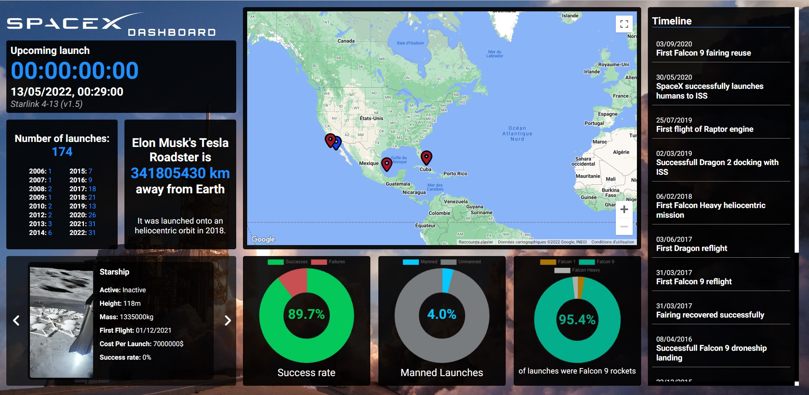

# SpaceX dashboard

This project is a simple dashboard website made with data coming from the [SpaceX API](https://github.com/r-spacex/SpaceX-API). 

Project can be viewed [here](https://spacex-api-dashboard.netlify.app/).

*We are not affiliated, associated, authorized, endorsed by, or in any way officially connected with Space Exploration Technologies Corp (SpaceX), or any of its subsidiaries or its affiliates. The names SpaceX as well as related names, marks, emblems and images are registered trademarks of their respective owners.*

## Table of content

* [Functionalities](#functionalities)
* [Technologies](#technologies)
* [Setup and launch](#setup-and-launch)
* [External ressources](#external-ressources)
* [Visuals](#visuals)

## Functionalities

This website pulls data from the SpaceX API's lauches, rockets, landpads, launchpads, roadster and history endpoints and displays them to the user.

You can click on the map pins to see a panel with details about the location they represent.

If you view the site on a large screen, the Rockets component features a carousel that scrolls automatically and you can click on the arrows to scroll it manually if you want. 

## Technologies

* [React 17.0.2](https://reactjs.org/) (**DO NOT** upgrade it to React 18, it breaks the map component)
* [Sass 1.51](https://sass-lang.com/)
* [react-chartjs-2 4.1.10](https://react-chartjs-2.js.org/) and [chart.js 3.7.1](https://www.chartjs.org/docs/latest/) (they go together)
* [google-map-react 2.1.10](https://www.npmjs.com/package/google-map-react)
* [Node.js 16.15](https://nodejs.org/en/)
* npm 8.5.5

## Setup and launch

You can see the finished project at [https://spacex-api-dashboard.netlify.app/](https://spacex-api-dashboard.netlify.app/).

If you want to download the source code, either fork the project on GitHub or download it manually, then open it in your favourite code editor.

Do not forget to install all the required packages with `npm install`

Once everything is set up, type `npm start` to start the development server and you should see the development server open at `localhost:3000` in your web browser.

If you wish to change the CSS, don't forget to start Sass processing with `npm run sass` or you won't see your changes (don't be like me). Only change the file with .scss extensions. The .css files are generated automatically from the .scss files.

If you want to run the unit tests, type `npm test`or `npm run test`.

All commands are listed in the "scripts" part of the `package.json` file.

You will need to provide a Google Maps API key for the map component to work properly. Since the dotenv package is included by default with create-react-app, all you need to do is create a `.env` file at the root of the project and paste the following code into it: 

```
REACT_APP_MAPS_API_KEY = /*Your API key*/
```

Every environment variable has to start with `REACT_APP` to be parsed by dotenv, the rest of the name is up to you, but don't forget to update the name in the Map component if you change it.

Don't forget to add your `.env` file to `.gitignore` if it isn't there already.

[You can get a Google map API key here.](https://developers.google.com/maps/documentation/javascript/get-api-key)

## External ressources

[Background image from the SpaceX Unsplash account.](https://unsplash.com/photos/uj3hvdfQujI)

[Integrating Google Maps with React tutorial](https://blog.logrocket.com/integrating-google-maps-react/)

[Countdown timer using React hooks](https://blog.greenroots.info/how-to-create-a-countdown-timer-using-react-hooks)

## Visuals


Original wireframe


Screeshot of website in Google Chrome v101


